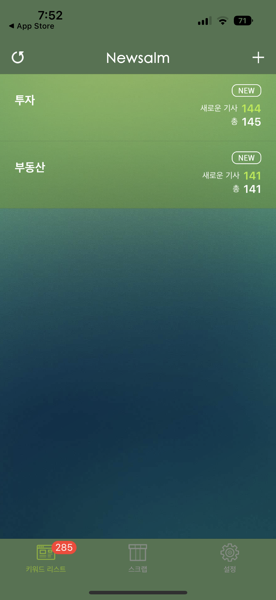
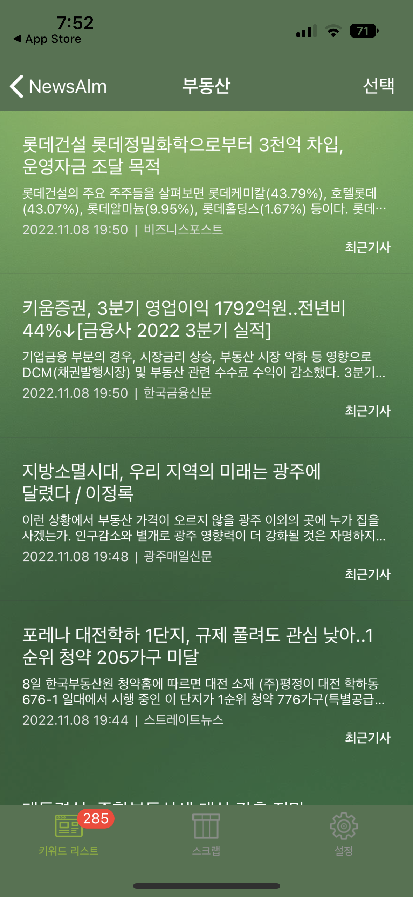
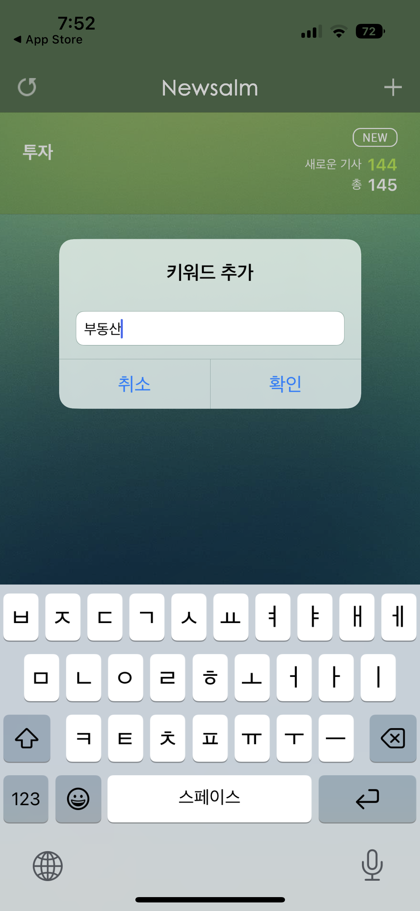

# Week 8

Second Project Subject Research 2

<iframe style="border: 1px solid rgba(0, 0, 0, 0.1);" width="800" height="450" src="https://www.figma.com/embed?embed_host=share&url=https%3A%2F%2Fwww.figma.com%2Ffile%2FeDsN8tRP0hhnybRFlxkb8m%2F%25EC%25A1%25B8%25ED%2594%2584%3Fnode-id%3D0%253A1%26t%3DOszKhAOIPbLuvwX0-1" allowfullscreen></iframe>

#### 뉴스 모아보기 어플

### 	- 키워드 중심

### 	

### 	- 가독성 중요

### 	- 내가 관심있는 뉴스만 보고 싶음 /  취향 위주의 기사

	### 	- 실시간 인기있는 뉴스
	
	### 	- 같은 관심사의 뉴스로 다른사람들과의 소통에 재미
	
	### 	- 요약된 뉴스를 보고 싶음 (숏컷뉴스)

